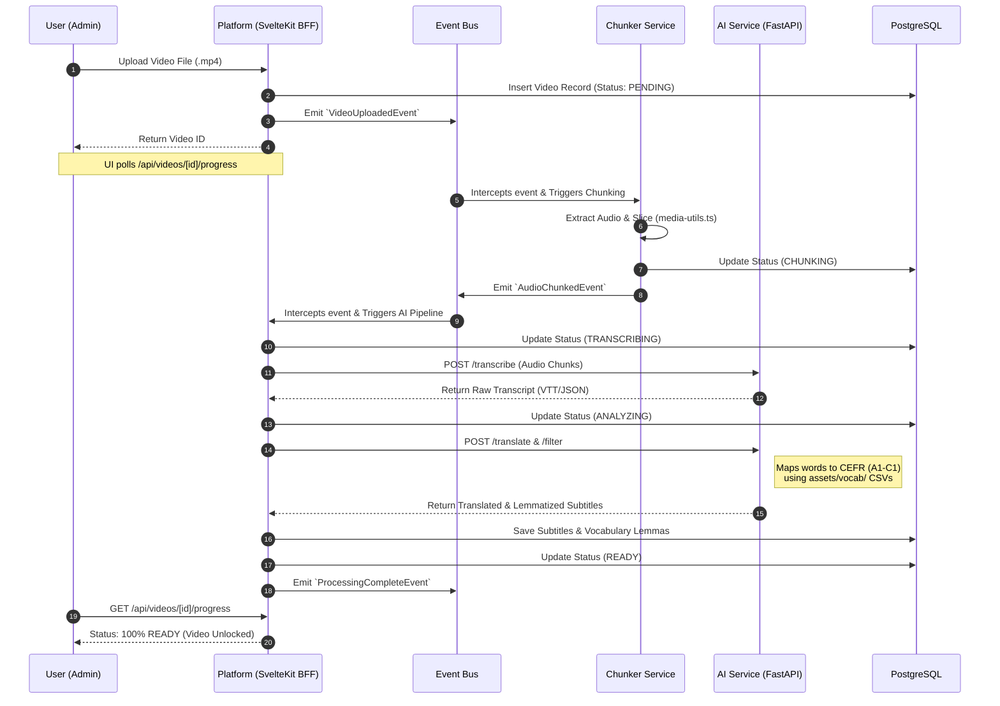

Here is the comprehensive architectural blueprint for **Notflix**, reverse-engineered and synthesized from your monorepo’s file structure, infrastructural boundaries, Architecture Decision Records (ADRs), and Specifications.

This blueprint incorporates the decoupling and designer-handoff strategies discussed previously, acting as the "North Star" for your project's development.

---

### 1. Visual Architecture: System Topology

This diagram maps the high-level flow of data, network boundaries, and how the different services interact to deliver the AI-powered learning experience while isolating heavy workloads.

```mermaid
flowchart TB
    %% Actors
    Learner([Language Learner])
    Admin([Content Creator])
    Designer([UI/UX Designer])

    %% Edge & Infra
    subgraph Infra [Infrastructure & Edge Layer]
        Kong[Kong API Gateway\nReverse Proxy, Rate Limiting, Routing]
    end

    %% External
    ExternalLLM[External AI Models\nOpenAI / Whisper / Claude]

    %% Monorepo
    subgraph Monorepo [Notflix pnpm Monorepo Workspace]
        
        %% Component Workshop
        Histoire[[Histoire / Storybook\nStatic UI Workshop]]

        %% SvelteKit Platform
        subgraph Platform [Platform App - SvelteKit / Node.js]
            UI[Frontend UI\nSvelte, Tailwind, Shadcn]
            BFF[Backend-For-Frontend\nAPI Routes, Auth, Session]
            
            subgraph Domain [Domain Services]
                EventBus((Event Bus\nAsync Choreography))
                TaskReg[Task Registry\nProgress Tracking]
                UploadPipe[Upload & Chunker\nMedia Processing]
                VocabSvc[Vocabulary & Game Engine]
            end
            
            Adapters([Ports & Adapters\nReal vs Mock AI Gateway])
        end

        %% AI Microservice
        subgraph AIService [AI Microservice - FastAPI / Python]
            FastAPI[FastAPI Endpoints]
            Transcriber[Transcriber\nAudio to VTT/SRT]
            Translator[Translator\nMulti-Language]
            Filter[Linguistic Filter\nCEFR A1-C1 Parsing]
        end

        %% Shared Packages
        subgraph Packages [Shared Packages]
            DBClient[Database Package\nDrizzle ORM + Schema]
            Types>Shared TypeScript Types]
        end
    end

    %% Persistence
    subgraph Persistence [Data Persistence]
        DB[(PostgreSQL)]
        Storage[(Media Storage\nLocal Vol / S3)]
    end

    %% Connections
    Learner -->|HTTPS/WSS| Kong
    Admin -->|HTTPS| Kong
    Designer -.->|Reviews Static UI| Histoire
    Histoire -.->|Renders| UI

    Kong -->|SSR & Assets| UI
    Kong -->|API Requests| BFF

    UI <-->|Fetch / Form Actions| BFF
    BFF -->|Emits Events| EventBus
    EventBus --> TaskReg
    EventBus --> UploadPipe
    EventBus --> VocabSvc
    
    UploadPipe --> Adapters
    TaskReg <--> Adapters
    Adapters <-->|Internal HTTP/REST| FastAPI
    
    FastAPI --> Transcriber
    FastAPI --> Translator
    FastAPI --> Filter
    
    Transcriber <--> ExternalLLM
    Translator <--> ExternalLLM
    Filter <--> ExternalLLM

    BFF <--> DBClient
    DBClient <-->|SQL / TCP| DB
    
    BFF <-->|I/O| Storage
    FastAPI <-->|I/O| Storage
    
    BFF -.-> Types
    FastAPI -.-> Types

    classDef svelte fill:#ff3e00,stroke:#fff,stroke-width:2px,color:#fff;
    classDef python fill:#3776ab,stroke:#ffd43b,stroke-width:2px,color:#fff;
    classDef data fill:#336791,stroke:#fff,stroke-width:2px,color:#fff;
    classDef infra fill:#00ba7c,stroke:#fff,stroke-width:2px,color:#fff;
    classDef workshop fill:#ff69b4,stroke:#fff,stroke-width:2px,color:#fff;

    class UI,BFF,Domain,UploadPipe,VocabSvc,Adapters svelte;
    class FastAPI,Transcriber,Translator,Filter python;
    class DB,Storage,DBClient data;
    class Kong Infra infra;
    class Histoire workshop;
```

---

### 2. Visual Architecture: Asynchronous Processing Pipeline

Because AI transcription and LLM translations are slow and CPU-heavy, the system must not block the Node.js event loop. It relies on an **Event-Driven Choreography** pattern.



---

### 3. Architecture Decision Records (ADRs) Mapped

Your `docs/architecture/` folder acts as the constitution for the codebase. Here is how the technical rules are enforced across the monorepo:

| ADR ID | Decision & Rationale | Architectural Impact & Enforcement |
| :--- | :--- | :--- |
| **ADR-001** | **Master Monorepo** (pnpm workspaces) | Keeps SvelteKit, Python FastAPI, and Database schemas perfectly version-synced. Types flow seamlessly from `apps/platform/src/lib/types.ts` into both Svelte and Python. |
| **ADR-002** | **Centralized Authentication** | Auth is handled entirely in the SvelteKit BFF (`auth-client.ts`, `infrastructure/auth.ts`) via secure HTTP-Only cookies. API routes and `/studio` are protected natively via SvelteKit `hooks.server.ts`. |
| **ADR-003** | **AI Service Security** | The FastAPI Python app is isolated from the public internet. Kong Gateway routes public traffic to SvelteKit, preventing unauthorized execution of expensive LLM transcription tasks. |
| **ADR-004** | **Observability** | Centralized logging (`api/log`) and metrics (`dashboard-metrics.ts`). Crucial for tracing asynchronous, multi-step video processing failures across the Node/Python boundary. |
| **ADR-005** | **DI & Testing Strategy** | Hexagonal Architecture (Ports & Adapters). Ensures the SvelteKit app can be unit tested locally using `mock-ai-gateway.ts` without spending API tokens or running Python. |
| **ADR-006** | **Frontend Stack** | SvelteKit + Tailwind + Shadcn-Svelte. Prioritizes Server-Side Rendering (SSR) for SEO and extremely low Virtual-DOM overhead (crucial for 60fps video player overlays). |
| **ADR-007** | **Idiomatic Backend Patterns** | Shift from God-Class Orchestrators toward Event-Driven Choreography. *(Note: Deprecating `video-orchestrator.service.ts` in favor of `event-bus.ts` fulfills this ADR).* |

---

### 4. Functional Specifications (Specs) Mapped

The `docs/specs/` directory defines the core domain logic and business constraints. The architecture supports these as follows:

| Specification | Description & Code Mapping |
| :--- | :--- |
| **`design-brief.md`** & **`doc-authority.md`** | Defines the "Netflix-style" UX tailored for language acquisition. Establishes this documentation folder as the Single Source of Truth (SSOT), preventing configuration drift. |
| **`database-schema.md`** | Realized in `apps/platform/src/lib/server/db/schema.ts` (Drizzle ORM). Maps the relational integrity between Users -> Videos -> Subtitles -> Vocabulary Lemmas -> Known Words. |
| **`functional-specs.md`** | Defines the user workflows: Admins upload media via `/studio/upload`. Users consume media via `/watch/[id]`, clicking unknown words to trigger interactive popups. |
| **`processing-progress.md`** | Defines the state-machine for async processing (`UPLOADED` ➔ `CHUNKING` ➔ `TRANSCRIBING` ➔ `FILTERING` ➔ `READY`). Polled by the UI at `/api/videos/[id]/progress`. |
| **`learning-session-state.md`** | The Finite State Machine (FSM) for a user's learning loop. Governs the logic inside `GameOverlay.svelte`—when a video pauses, how quizzes are presented, and how answers update the database via `/api/words/known/`. |

---

### 5. Architectural Solutions to Your Core Challenges

Based on your prompt, here is how you implement your specific requirements using this architecture:

#### Problem 1: "I want clear separated units that I can test separately without monster mocks."
**Solution: Idiomatic Synchronous Pipeline (ADR-007) + Native Svelte Locals (ADR-005)**
1.  **Kill the God-Class Orchestrator:** Do not use a sprawling orchestrator to handle everything.
2.  **Use Direct Service Functions:** The Upload Service saves the file and directly triggers the pipeline.
3.  **The Testing Benefit:** To test the Chunker, you don't mock the AI service. It becomes a pure, easily testable unit.
4.  **Kill the DI Container:** Delete `container.ts`. Instantiate your services once per request inside SvelteKit's `hooks.server.ts` and pass them via `event.locals`. Testing a Svelte endpoint is now as simple as passing a mock `locals` object.

#### Problem 2: "I want a way to show the current designs to the designer even if I can't get the server running."
**Solution: A Static Component Workshop (ADR-006)**
Because you chose Svelte, Tailwind, and Shadcn, your UI components (`src/lib/components/ui/` and `src/lib/components/player/`) are completely decoupled from backend data fetching.
1.  **Install Histoire:** Add [Histoire](https://histoire.dev/) (the Svelte-native alternative to Storybook).
2.  **Create Stories:** Create `.story.svelte` files next to your UI components (e.g., `VideoPlayer.story.svelte`). Feed them hardcoded JSON data or the `mock-subtitle.vtt` file from your test fixtures.
3.  **Static Export:** Run `npm run story:build`. This generates a purely static HTML/JS folder of your entire UI library.
4.  **The Handoff:** Host this static folder for free on Vercel, Netlify, or GitHub Pages. Your designer gets a live URL to review UI states, animations, and dark mode—**no Python, PostgreSQL, Docker, or server required.**
